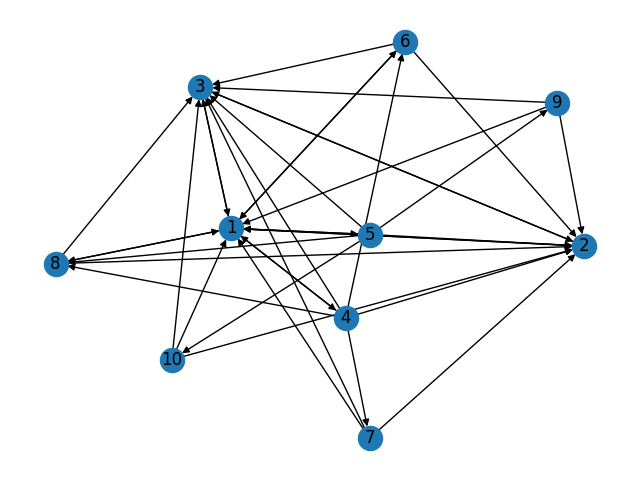
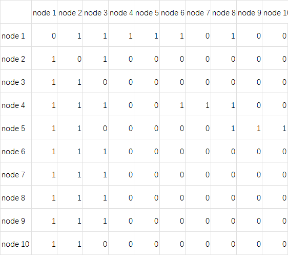

# CSE 598 Project 1

本项目我选取的是一个医疗网站，取其中一部分作为研究对象。

节点1，网站根目录 https://getwellue.com/

节点2，关于我们 https://getwellue.com/pages/our-mission

节点3，购物车 https://getwellue.com/cart

集合目录：

```
节点4，https://getwellue.com/pages/ekg-monitor-collection
节点5，https://getwellue.com/pages/vital-signs-monitor-collection
```

5个产品页面

	节点6，https://getwellue.com/pages/duoek-hand-held-wearable-ekg-tracker
	节点7，https://getwellue.com/pages/pulsebit-ex-ekg-monitor
	节点8，https://getwellue.com/pages/visualbeat-heart-rate-monitor
	节点9，https://getwellue.com/pages/checkme-pro-vital-signs-monitor
	节点10，https://getwellue.com/pages/checkme-pod-handheld-oximeter-with-thermometer
所有页面可以跳转回根目录、关于我们、购物车。

集合会包含所属产品目录。

本次作业已上传至：https://github.com/jiang1991/cse598_project1

## Question 1

1. 有向图

   见 `main.py` 中 `cal_dg()` 函数。运行结果：

   

2. 有向图邻接矩阵



3. 无向图矩阵保存在文件 graph_adjacency_matrix.csv

4. 计算每个节点的特征向量中心度

   1. 计算无向图的所有特征值：

      6.492738857625188
      -2.9999999999999987
      0.1837401018750402
      -1.6764789595002247
      1.4142135623730947
      -0.9999999999999994
      -1.0000000000000007
      -1.4142135623730947
      -1.0543605291304522e-17
      0.0

   2. 选择最大特征值： 6.49

   3. 求最大特征值对应的特征向量：

      [0.41,0.41,0.41,0.30,0.30,0.23,0.23,0.28,0.23,0.23].T
      即：
      | 节点 | 中间中心性 | 排名 |
      | ---- | ---------- | ---- |
      | 1    | 0.41         | 1    |
      | 2    | 0.41         | 1    |
      | 3    | 0.41         | 1    |
      | 4    | 0.30         | 4    |
      | 5    | 0.30         | 4    |
      | 6    | 0.23         | 7    |
      | 7    | 0.23         | 7    |
      | 8    | 0.28         | 6    |
      | 9    | 0.23         | 7    |
      | 10   | 0.23         | 7    |

5. 计算无向图的中间中心度

   | 节点 | 度 |中心性 | 排名 |
   | ---- | -- | ------ | ---- |
   | 1    |	9 | 1     | 1    |
   | 2    |	9 | 1     | 1    |
   | 3    |	9 | 1     | 1    |
   | 4    |	6 | 2/3     | 4    |
   | 5    |	6 | 2/3     | 4    |
   | 6    |	4 | 4/9     | 7    |
   | 7    |	4 | 4/9     | 7    |
   | 8    |	5 | 5/9     | 6    |
   | 9    |	4 | 4/9     | 7    |
   | 10   |	4 | 4/9     | 7    |

## Question 2

1. 输入文件并计算计算特征向量中心度

   见 `main.py` 中 `question_2()` 函数。运行结果：

   ```
   0 0.4108340493639789
   1 0.4108340493639789
   2 0.4108340493639789
   3 0.30663408598151726
   4 0.30663408598151726
   5 0.2370552218167837
   6 0.2370552218167837
   7 0.2842824537598622
   8 0.2370552218167837
   9 0.2370552218167837
   ```

   